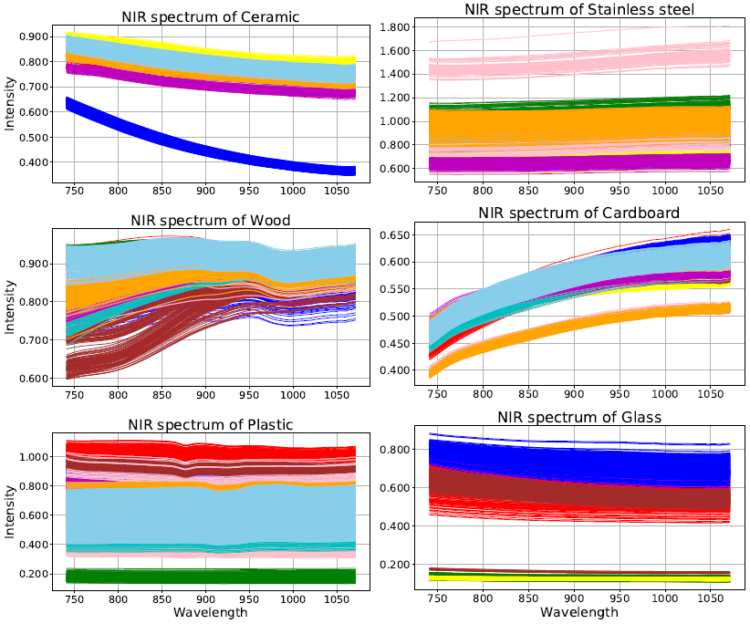
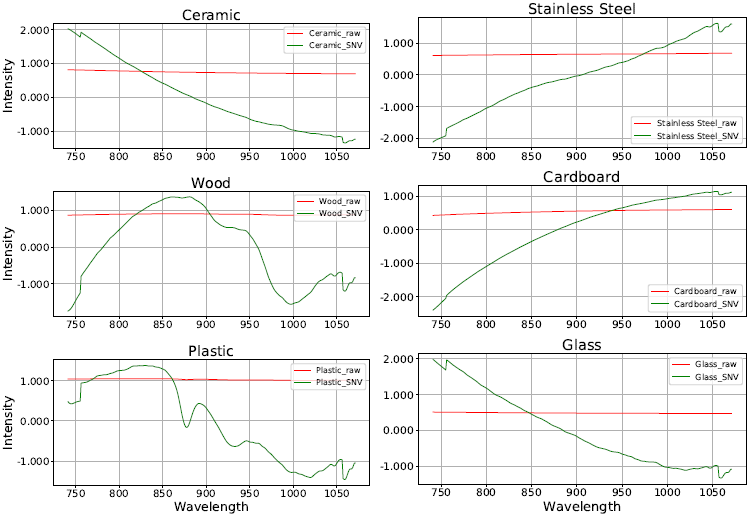

# Overview
Near-Infrared Spectroscopy (NIR or NIRS) is a powerful analytical technique for material recognition across diverse applications. Operating in the 780–2500 nm range of the electromagnetic spectrum, NIR enables deep penetration into samples due to its low molar absorption, requiring minimal or no preparation. This makes NIRS ideal for rapid, nondestructive, and cost-effective molecular-level analysis. It can assess multiple parameters simultaneously with high precision and performs reliably in low-light environments. Compared to traditional chemical analysis, NIR offers faster results with fewer preparation steps, making it well-suited for real-time and embedded systems.

# NIR_dataset
We constructed a near-infrared (NIR) spectral dataset comprising common daily-use objects across six material categories: ceramic, wood, plastic, cardboard, stainless steel, and glass. For ceramic, wood, plastic, and cardboard, ten objects per category were selected, while nine stainless steel and five glass objects were included. Each object contributed ten samples for spectral measurement. For larger items such as plates, pans, and cardboard boxes, approximately 30 scans per sample were collected, whereas smaller objects like spoons, forks, and plastic cups had fewer scans. In total, the dataset consists of 15,936 spectra, capturing a diverse range of material characteristics for NIR analysis.

 

# Data Preporcessing

Standard Normal Variate (SNV) is used to preprocess the data to improve the performance of the material recognition algorithm.

# Material Recognition

A sample multilayer perceptron (MLP) deep learning network, implemented in **nir_mlp.py**, is provided as a baseline model for material classification using the collected NIR spectral dataset.

# Publications

This dataset is used in the following paper:

    @inproceedings{li2021learning,
      title={Learning Task-Oriented Dexterous Grasping from Human Knowledge},
      author={Li, Hui and Zhang, Yinlong and Li, Yanan and He, Hongsheng},
      booktitle={2021 IEEE International Conference on Robotics and Automation (ICRA)},
      pages={6192--6198},
      year={2021},
      organization={IEEE}
    }
[[download paper](https://ieeexplore.ieee.org/abstract/document/9562073)]

    @inproceedings{li2020magichand,
      title={MagicHand: Context-Aware Dexterous Grasping Using an Anthropomorphic Robotic Hand},
      author={Li, Hui and Tan, Jindong and He, Hongsheng},
      booktitle={2020 IEEE International Conference on Robotics and Automation (ICRA)},
      pages={9895--9901},
      year={2020},
      organization={IEEE}
    }
[[download paper](https://ieeexplore.ieee.org/document/9196538)]

    @inproceedings{rao2018learning,
      title={Learning robotic grasping strategy based on natural-language object descriptions},
      author={Rao, Achyutha Bharath and Krishnan, Krishna and He, Hongsheng},
      booktitle={2018 IEEE/RSJ International Conference on Intelligent Robots and Systems (IROS)},
      pages={882--887},
      year={2018},
      organization={IEEE}
    }
[[download paper](https://ieeexplore.ieee.org/document/8593886)]